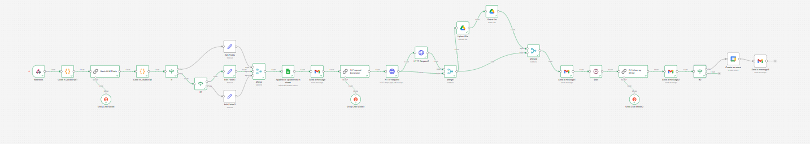
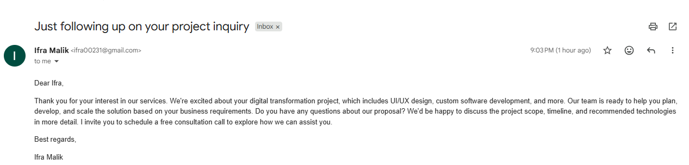
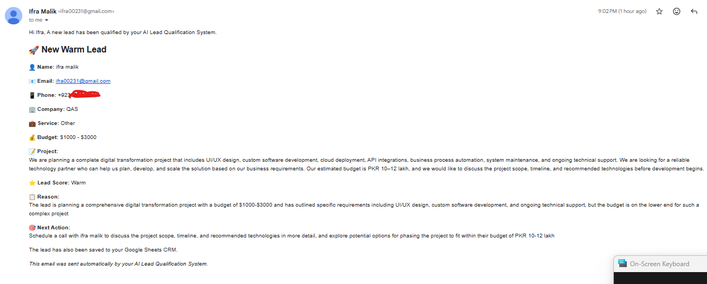
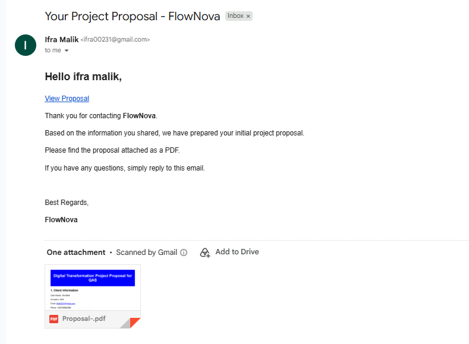
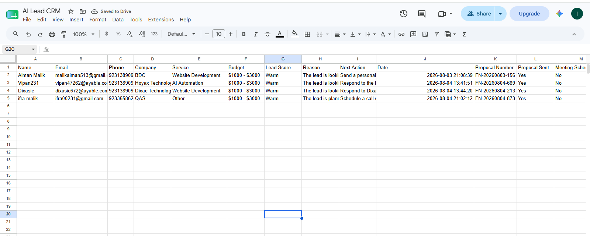

# 🚀 AI Lead Qualification System

An end-to-end AI-powered lead qualification and sales automation workflow built with **n8n**, **Groq Llama 3.3**, **Google Workspace**, and **PDF.co**.

This workflow automatically analyzes incoming leads, qualifies them using AI, stores them in a CRM, generates personalized project proposals, schedules discovery calls for high-value clients, and manages automated follow-ups without manual intervention.

---

## ✨ Features

* 🌐 Receives lead submissions through a Webhook
* 🤖 AI-powered lead qualification using Groq Llama 3.3
* 📊 Automatically categorizes leads as:

  * High
  * Warm
  * Low
* 📝 Generates a unique proposal number
* 📁 Saves or updates leads in Google Sheets CRM
* 📧 Sends internal lead notification emails
* 📄 Generates professional HTML project proposals
* 📑 Converts proposals into PDF files
* ☁️ Uploads proposals to Google Drive
* 🔗 Creates shareable proposal links
* 📬 Sends proposal emails to clients
* ⏳ Sends automated follow-up emails
* 📅 Automatically schedules Google Meet discovery calls for high-priority leads
* 📨 Sends meeting confirmation emails

---

## 🏗 Workflow Architecture

```text
Lead Form
      │
      ▼
Webhook
      │
      ▼
Extract Lead Data
      │
      ▼
AI Lead Qualification
      │
      ▼
Generate Lead Score
      │
      ▼
High / Warm / Low Routing
      │
      ▼
Google Sheets CRM
      │
      ▼
Internal Notification Email
      │
      ▼
AI Proposal Generator
      │
      ▼
Generate PDF
      │
      ▼
Upload to Google Drive
      │
      ▼
Share Proposal Link
      │
      ▼
Send Proposal Email
      │
      ▼
Wait
      │
      ▼
AI Follow-up Email
      │
      ▼
If High Lead
      │
      ▼
Schedule Google Meet
      │
      ▼
Meeting Confirmation Email
```

---

# 🛠 Technologies Used

* n8n
* Groq API (Llama 3.3 70B)
* Google Sheets
* Gmail API
* Google Drive API
* Google Calendar API
* PDF.co API
* JavaScript
* HTML

---

# 📂 Workflow Components

### 1. Webhook

Receives incoming lead information from a website or form submission.

### 2. Lead Data Processing

Extracts and formats:

* Name
* Email
* Phone
* Company
* Requested Service
* Budget
* Project Description

### 3. AI Lead Qualification

The AI evaluates:

* Budget
* Requested service
* Company details
* Project description

Outputs:

```json
{
  "lead_score": "High",
  "reason": "...",
  "next_action": "..."
}
```

---

### 4. CRM Storage

Every lead is automatically stored inside Google Sheets with:

* Client Information
* Lead Score
* Proposal Number
* Status
* Date
* Follow-up status
* Conversion status

---

### 5. Proposal Generator

The workflow generates a professional proposal containing:

* Client Information
* Project Overview
* Scope of Work
* Deliverables
* Estimated Timeline
* Budget
* Recommended Next Steps

---

### 6. PDF Generation

The proposal is converted into a PDF using PDF.co.

---

### 7. Google Drive Integration

The generated proposal is:

* Uploaded
* Shared publicly
* Used inside client emails

---

### 8. Client Communication

The workflow automatically sends:

* Proposal email
* Follow-up email
* Meeting invitation (High Leads only)
* Meeting confirmation email

---

## 📊 Lead Qualification Rules

| Lead Type | Criteria                                   |
| --------- | ------------------------------------------ |
| 🟢 High   | Budget above $3000 with clear requirements |
| 🟡 Warm   | Budget between $1000 and $3000             |
| 🔵 Low    | Budget below $1000 or unclear requirements |

---

# 🔄 Automation Flow

1. Lead submits website form
2. Webhook receives data
3. AI evaluates lead quality
4. Lead saved to CRM
5. Internal notification sent
6. Proposal generated
7. Proposal converted to PDF
8. PDF uploaded to Google Drive
9. Client receives proposal
10. Follow-up email sent
11. High-value leads receive scheduled discovery call

---

# 📸 Screenshots








---

# 🚀 Future Improvements

* Slack notifications
* WhatsApp integration
* Stripe payment links
* HubSpot CRM integration
* Airtable support
* Multi-language proposals
* Analytics dashboard
* AI meeting summaries
* Automatic contract generation

---

# 📬 Contact

**Ifra Malik**

* LinkedIn: https://linkedin.com/in/ifra-malik
* GitHub: https://github.com/ifra489

---

## ⭐ Support

If you found this project helpful, consider giving it a **Star** on GitHub. It helps others discover the project and supports future improvements.
